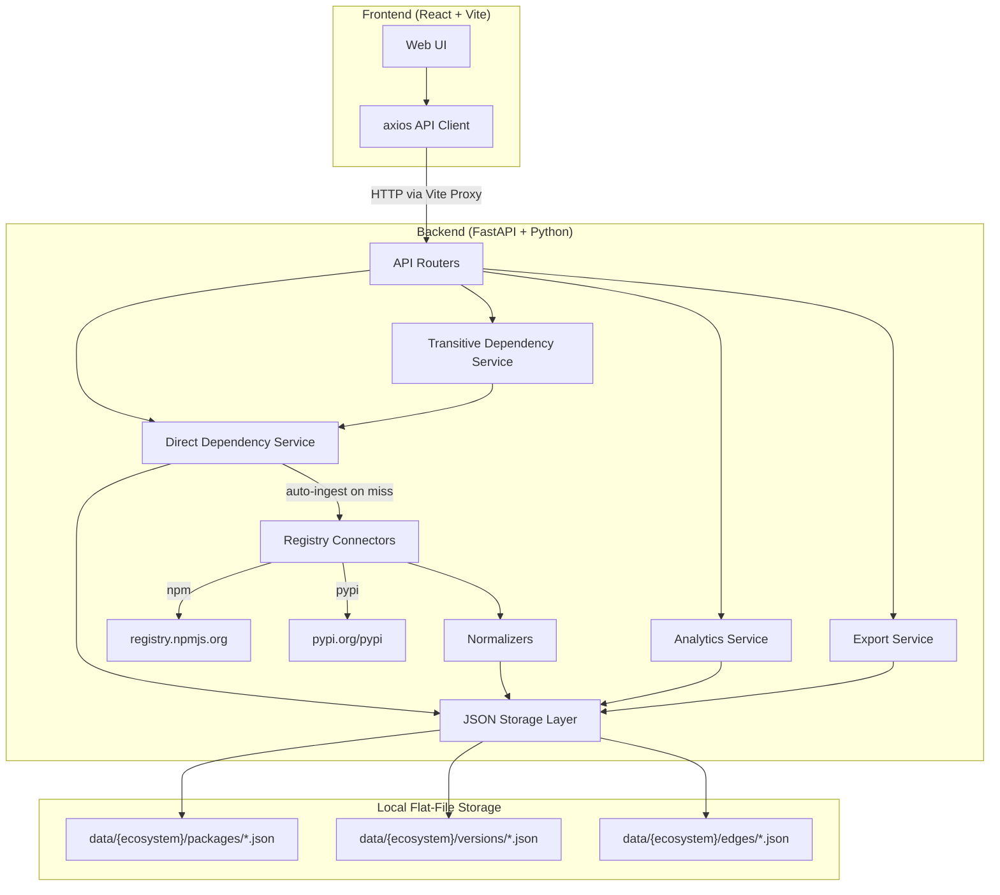
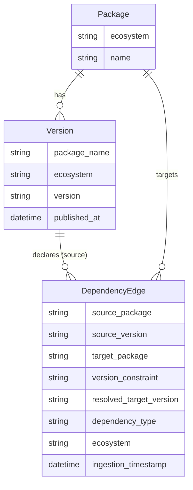
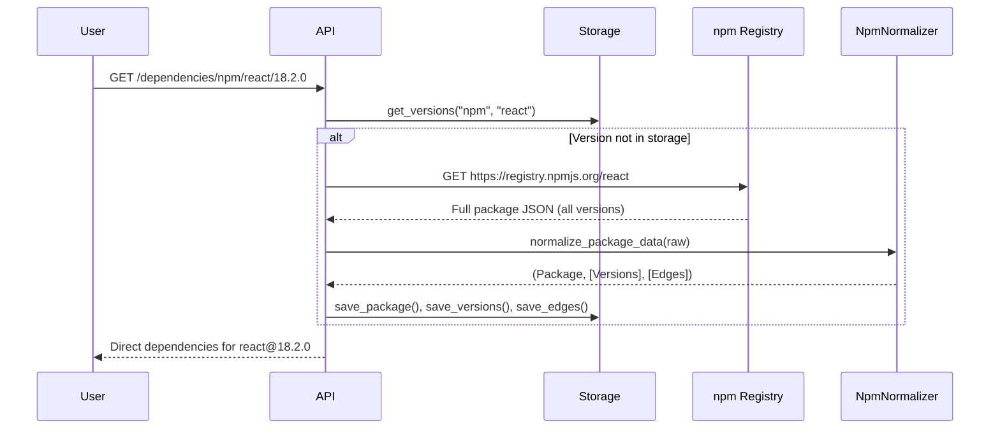
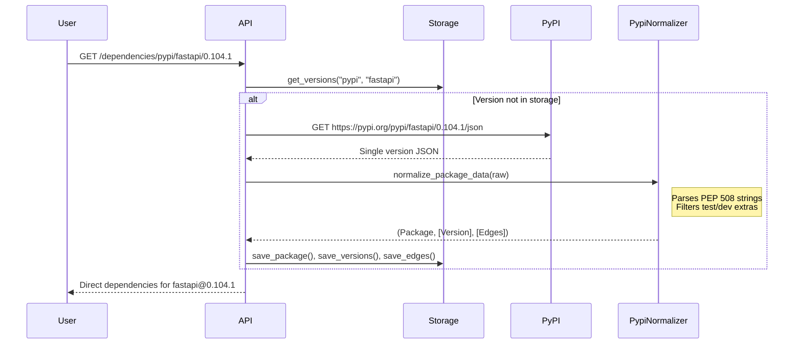

# OSCAR Dependency Graph Observatory — Technical Reference

**Version:** 0.1.0 (MVP)  
**Date:** March 2026  
**Author:** Fabian Gonzalez  

---

## 1. Project Overview

The OSCAR Dependency Graph Observatory is a **graph-based analysis tool** for studying transitive dependency structures, systemic risk, and structural patterns in open-source software ecosystems. It currently supports **npm** and **PyPI**.

### Architecture



### Current Dataset Size (npm)

| Metric | Value |
|---|---|
| Total edge records | 120,121 |
| Total version records | 12,599 |
| Unique package names | 492 |
| Edge files on disk | ~36 MB |

---

## 2. API Endpoints

All endpoints are served by FastAPI at `http://localhost:8000`. The frontend proxies requests via `/api`.

### 2.1 System

#### `GET /health`

Returns the operational status of the backend.

**Response:**
```json
{ "status": "ok" }
```

---

### 2.2 Dependencies

#### `GET /dependencies/{ecosystem}/{package}/{version}`

Returns the **direct (immediate) dependencies** of a specific package version. If the package has not been previously ingested, it is fetched from the registry automatically.

**Parameters:**
| Parameter | Type | Example |
|---|---|---|
| `ecosystem` | path | `npm`, `pypi` |
| `package` | path | `react`, `fastapi` |
| `version` | path | `18.2.0`, `0.104.1` |

**Response:**
```json
{
  "package": "react",
  "version": "18.2.0",
  "ecosystem": "npm",
  "dependencies": [
    { "name": "loose-envify", "constraint": "^1.1.0" }
  ]
}
```

**Auto-Ingestion Behavior:** If the requested version is not in local storage, the backend transparently calls the appropriate registry API, normalizes the data, and stores it before returning.

---

#### `GET /dependencies/{ecosystem}/{package}/{version}/transitive`

Returns the **full transitive dependency graph** using Breadth-First Search (BFS). Auto-ingests any discovered packages not yet in storage.

**Parameters:** Same as direct dependencies.

**Response:**
```json
{
  "root": "npm:react@18.2.0",
  "nodes": [
    { "id": "npm:react@18.2.0", "label": "react@18.2.0", "ecosystem": "npm", "package": "react", "version": "18.2.0" }
  ],
  "edges": [
    { "source": "npm:react@18.2.0", "target": "npm:loose-envify@1.4.0", "constraint": "^1.1.0" }
  ]
}
```

**Constraints:**
- Maximum 1,000 nodes per BFS traversal (hard cap to prevent unbounded ingestion)
- Version resolution is **naive** — picks the lexically last stored version rather than resolving SemVer constraints

---

### 2.3 Package Details

#### `GET /packages/{ecosystem}/{package}/{version}`

Returns package metadata and computed metrics for a specific version.

**Response:**
```json
{
  "id": "npm:react@18.2.0",
  "ecosystem": "npm",
  "name": "react",
  "version": "18.2.0",
  "metrics": {
    "directDependencies": 1,
    "transitiveDependencies": 0,
    "fanIn": 5,
    "fanOut": 1,
    "bottleneckScore": 5.0,
    "diamondCount": 0
  }
}
```

---

### 2.4 Analytics

#### `GET /analytics/top-risk`

Returns packages ranked by their ecosystem-wide **bottleneck risk score**.

**Parameters:**
| Parameter | Type | Default | Description |
|---|---|---|---|
| `ecosystem` | query | `npm` | Ecosystem to analyze |
| `limit` | query | `10` | Maximum items to return |

**Response:**
```json
{
  "items": [
    {
      "id": "npm:es-errors@1.3.0",
      "ecosystem": "npm",
      "name": "es-errors",
      "version": "1.3.0",
      "fanIn": 8,
      "fanOut": 37,
      "versionFanOut": 0,
      "bottleneckScore": 296.0
    }
  ]
}
```

**Field Definitions:**
| Field | Scope | Description |
|---|---|---|
| `fanIn` | All versions, deduplicated by package name | Count of unique packages that declare *any* version of this package as a dependency |
| `fanOut` | All versions, sum of all edges | Total number of dependency declarations across all stored versions |
| `versionFanOut` | Single specific version | Direct dependencies of the exact version displayed |
| `bottleneckScore` | Computed | `fanIn × fanOut` (or `fanIn` if `fanOut = 0`) |

---

### 2.5 Export

#### `GET /export/{ecosystem}/graph`

Exports the complete stored graph dataset for downstream analysis tools.

**Parameters:**
| Parameter | Type | Default | Description |
|---|---|---|---|
| `format` | query | `json` | `json` or `csv` |

**JSON format:** Returns `{ "ecosystem": "...", "nodes": [...], "edges": [...] }`.

**CSV format:** Returns a flat edge list with headers `source,target,constraint,ecosystem`. Compatible with Gephi, NetworkX, Pandas.

---

## 3. Metric Calculations

### 3.1 Fan-In (Package-Level)

**Definition:** The number of **unique packages** (not version edges) that depend on the target package anywhere in the stored dataset.

**Formula:**

```
fan_in(P) = |{ Q : ∃ edge(Q@v → P) in E, ∀ v }|
```

**Implementation:** For each edge in the dataset, the target package's fan-in set collects the source **package name** (not the source version). The final fan-in is the cardinality of this set.

**Example:** If `next@13.0.0`, `next@13.1.0`, and `next@14.0.0` all depend on `styled-jsx`, fan-in = 1 (one unique dependent: `next`).

### 3.2 Fan-Out (Aggregate)

**Definition:** Total number of dependency edges where this package is the source, across all its stored versions.

**Formula:**

```
fan_out(P) = |{ edge(P@v → Q) ∈ E, ∀ v, ∀ Q }|
```

### 3.3 Version Fan-Out

**Definition:** Direct dependencies of a single specific version.

**Formula:**

```
version_fan_out(P, v) = |{ edge(P@v → Q) ∈ E, ∀ Q }|
```

### 3.4 Bottleneck Score

**Definition:** A centrality proxy measuring how much a package sits at a critical junction — both widely depended upon AND having many transitive dependencies itself.

**Formula:**

```
bottleneck(P) = fan_in(P) × fan_out(P)     if fan_out > 0
bottleneck(P) = fan_in(P)                   otherwise
```

**Interpretation:** A high score means the package is both a popular dependency target AND has a large attack surface through its own dependencies. If compromised, impact propagates both upstream (to dependents) and downstream (through its own deps).

### 3.5 Per-Package Metrics (Package Details)

When querying a single package via `/packages/{eco}/{pkg}/{ver}`:

```
direct_dependencies = |edges where source = (pkg, ver)|
fan_in              = |unique packages P where ∃ edge(P@any → pkg)|
fan_out             = direct_dependencies
bottleneck_score    = fan_in × fan_out
```

---

## 4. Data Model

### Domain Models



### Storage Layout

```
data/
  npm/
    packages/     # 78 files — one per unique package
      react.json
      express.json
    versions/     # 78 files — array of versions per package
      react.json  # contains [{version: "18.2.0", ...}, {version: "18.3.1", ...}]
    edges/        # 7,247 files — one per (package, version) pair
      react_18.2.0.json  # contains array of DependencyEdge objects
  pypi/
    packages/
    versions/
    edges/
```

---

## 5. Ingestion Pipeline

### npm



**npm behavior:** A single registry call returns ALL versions and ALL dependency declarations for a package. This means ingesting `react` populates edges for all 122+ versions at once.

### PyPI



**PyPI behavior:** Each call returns metadata for ONE version only. Dependencies are extracted from `requires_dist` (PEP 508 format). Test and dev extras are filtered out.

---

## 6. Known Limitations

| Area | Limitation | Impact |
|---|---|---|
| **Dataset coverage** | Only 492 unique packages ingested (on-demand only) | Top Risk rankings reflect the crawled subset, not the full ecosystem |
| **SemVer resolution** | Transitive BFS picks the lexically last stored version, not the SemVer-correct resolution | Graph edges may connect to the wrong version of a transitive dependency |
| **Fan-in precision** | Fan-in counts package-level dependents within our DB only | Packages not yet ingested are invisible to fan-in calculations |
| **Transitive dependencies count** | Always returns 0 in package details | Would require a full BFS per query — deferred to avoid performance issues |
| **Diamond detection** | Always returns 0 | Detection algorithm not yet implemented |
| **Storage model** | Flat JSON files — full ecosystem scans read thousands of files | Analytics queries are slow on large datasets |
| **PyPI single-version ingestion** | Each PyPI version requires a separate HTTP call | Building a complete PyPI dependency tree is much slower than npm |
| **CORS** | Currently allows all origins (`*`) | Must be tightened for any non-local deployment |
| **No authentication** | No API keys or access control | Acceptable for local/research use only |

---

## 7. Open-Source Readiness Assessment

### What the project does well

| Area | Status | Notes |
|---|---|---|
| **License** | ⚠️ TBD | Must be declared before public release (recommend MIT or Apache-2.0) |
| **README** | ✅ Good | Clear research motivation, objectives, hypothesis |
| **Zero-cost setup** | ✅ Excellent | No cloud accounts, databases, or paid APIs needed |
| **Reproducibility** | ✅ Good | Data is deterministically ingested from public registries |
| **Python dependencies** | ✅ Minimal | FastAPI, Pydantic, httpx — all well-maintained |
| **Frontend stack** | ✅ Standard | React + Vite + TypeScript — familiar to contributors |
| **Code structure** | ✅ Clean | Clear separation: ingestion → normalization → storage → analytics → API |
| **API documentation** | ✅ Auto-generated | FastAPI provides Swagger UI at `/docs` |

### What should be improved for open-source release

| Priority | Item | Why it matters |
|---|---|---|
| **Critical** | Add a LICENSE file | No license = no legal right to use or contribute |
| **Critical** | Add `CONTRIBUTING.md` | Tells contributors how to set up dev environment, run tests, submit PRs |
| **High** | Add unit tests | Zero test coverage currently — blocks confidence in contributions |
| **High** | Add `requirements.txt` or `pyproject.toml` | Backend has no documented Python dependency list |
| **High** | Add `.env.example` | Document available environment variables |
| **Medium** | Add CI pipeline (GitHub Actions) | Lint + test on PRs — standard for OSS projects |
| **Medium** | Dockerize the application | `docker-compose up` should start both frontend and backend |
| **Medium** | Update README "Getting Started" section | Current section says "Planned" but the app is functional |
| **Low** | Add code comments to frontend components | Most TypeScript files lack JSDoc or inline documentation |
| **Low** | Implement request rate limiting | Prevent abuse if deployed publicly |

---

## 8. Suggested Research Extensions

These are areas where the current codebase could be extended for academic research:

### 8.1 Temporal Analysis (Snapshots)
The `Snapshot` domain model exists but is unused. Implementing periodic graph snapshots would enable:
- Tracking how dependency centrality changes over time
- Detecting emerging risk concentrations before they become critical
- Research question 4 from the README could be directly addressed

### 8.2 Diamond Dependency Detection
The `diamondCount` metric exists in the schema but always returns 0. Implementing this would involve detecting cases where:
```
A → B → D
A → C → D  (diamond: D is reached via two independent paths)
```
This is relevant for version conflict analysis and failure propagation modeling.

### 8.3 Blast Radius Estimation
Currently, bottleneck score (fan-in × fan-out) is a simple centrality proxy. A more sophisticated blast radius could compute the **transitive closure** of all packages reachable downstream from a given package — i.e., "if this package is compromised, how many packages are transitively affected?"

### 8.4 Community Detection
Applying graph clustering algorithms (e.g., Louvain, label propagation) to the dependency graph could reveal natural "communities" of tightly interconnected packages — useful for understanding ecosystem structure and identifying single points of failure within communities.

### 8.5 Bus Factor Analysis
Enriching the data model with **maintainer information** (available from both npm and PyPI registry responses) could enable bus factor analysis: identifying critical packages maintained by very few individuals.

---

## 9. Environment & Configuration

All settings are managed via environment variables prefixed with `OSCAR_`:

| Variable | Default | Description |
|---|---|---|
| `OSCAR_APP_NAME` | "OSCAR Dependency Graph Observatory" | Application name |
| `OSCAR_APP_VERSION` | "0.1.0" | Application version |
| `OSCAR_DEBUG` | `false` | Enable debug logging |
| `OSCAR_NPM_REGISTRY_URL` | `https://registry.npmjs.org` | npm registry base URL |
| `OSCAR_PYPI_REGISTRY_URL` | `https://pypi.org/pypi` | PyPI registry base URL |
| `OSCAR_STORAGE_MODE` | `file` | Storage backend (`file`, `sqlite`, `postgres`) |
| `OSCAR_DATA_DIRECTORY` | `data` | Local data directory path |

---

## 10. Running the Application

### Prerequisites
- Python 3.11+
- Node.js 18+

### Backend
```bash
cd backend
python -m venv .venv
source .venv/bin/activate
pip install -r requirements.txt  # (needs to be created)
uvicorn app.main:app --reload
```

### Frontend
```bash
cd frontend
npm install
npm run dev
```

The frontend dev server proxies API requests to `http://127.0.0.1:8000` via Vite's proxy configuration.
