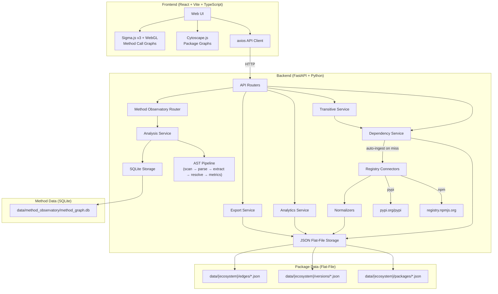
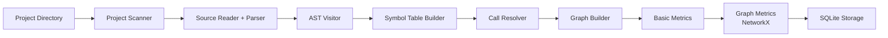
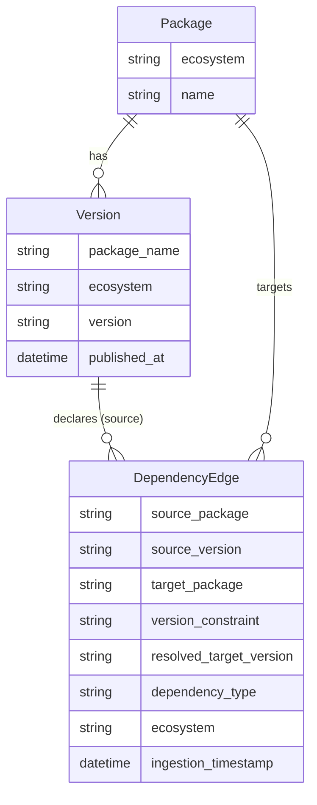
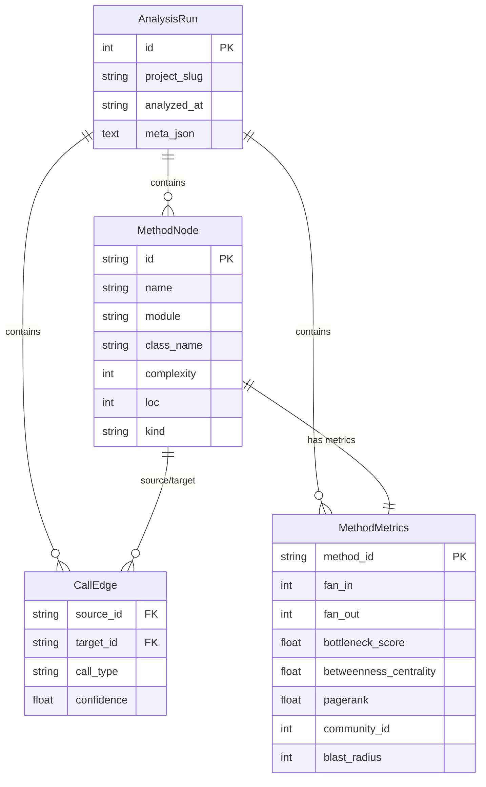
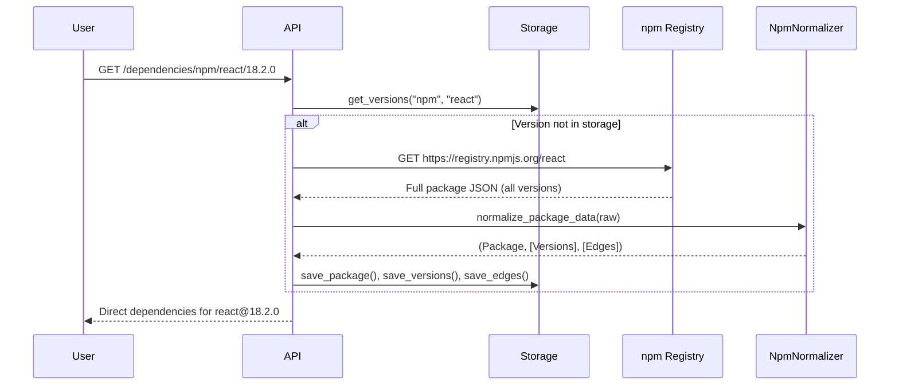
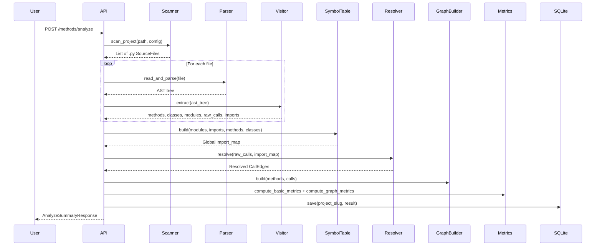

# OSCAR Dependency Graph Observatory — Technical Reference

**Version:** 0.2.0  
**Date:** March 2026  
**Author:** Fabian Gonzalez  

---

## 1. Project Overview

The OSCAR Dependency Graph Observatory is a **multi-resolution graph analysis tool** for studying structural risk in open-source software. It operates at two levels:

1. **Package Level** — Transitive dependency graphs across npm and PyPI ecosystems (inter-package edges)
2. **Method Level** — Internal call graphs within individual Python projects (intra-package edges)

### Architecture



### Frontend Pages

| Page | Route | Component | Description |
|---|---|---|---|
| Package Search | `/` | `PackageSearch` | Search npm/PyPI packages, trigger ingestion |
| Graph Viewer | `/graph` | `GraphViewer` | Interactive package dependency graph (Cytoscape.js) |
| Top Risk | `/analytics` | `TopRisk` | Ecosystem risk rankings + Method Hotspots tab |
| Method Explorer | `/methods` | `MethodExplorer` | Browse analyzed Python projects |
| Method Graph | `/methods/graph` | `MethodGraphViewer` | WebGL call graph visualization (Sigma.js) |
| Hotspot Dashboard | `/methods/hotspots` | `HotspotDashboard` | Composite risk table for methods |
| Community View | `/methods/communities` | `CommunityView` | Louvain cluster exploration |

### Frontend Components

| Component | Library | Purpose |
|---|---|---|
| `GraphCanvas` | Cytoscape.js | Renders package-level dependency graphs |
| `MethodCallGraph` | Sigma.js v3 + @react-sigma/core | Renders method-level call graphs via WebGL |
| `TopRiskTable` | — | Sortable package risk table |
| `Layout` | — | App shell with sidebar navigation |

---

## 2. API Endpoints — Package Level

All endpoints served by FastAPI at `http://localhost:8000`.

### 2.1 System

#### `GET /health`
Returns operational status. **Response:** `{ "status": "ok" }`

### 2.2 Dependencies

#### `GET /dependencies/{ecosystem}/{package}/{version}`
Returns **direct dependencies** of a specific version. Auto-ingests from registry on cache miss.

| Parameter | Type | Example |
|---|---|---|
| `ecosystem` | path | `npm`, `pypi` |
| `package` | path | `react`, `fastapi` |
| `version` | path | `18.2.0`, `0.104.1` |

#### `GET /dependencies/{ecosystem}/{package}/{version}/transitive`
Returns the **full transitive dependency graph** via BFS. Auto-ingests any undiscovered packages.

**Constraints:**
- Max 1,000 nodes per BFS traversal
- Version resolution is naive (picks lexically last stored version)

### 2.3 Package Details

#### `GET /packages/{ecosystem}/{package}/{version}`
Returns package metadata and computed metrics (directDependencies, fanIn, fanOut, bottleneckScore, diamondCount).

### 2.4 Analytics

#### `GET /analytics/top-risk`
Returns packages ranked by ecosystem-wide **bottleneck risk score** (`fanIn × fanOut`).

| Parameter | Type | Default | Description |
|---|---|---|---|
| `ecosystem` | query | `npm` | Ecosystem to analyze |
| `limit` | query | `10` | Maximum items |

### 2.5 Export

#### `GET /export/{ecosystem}/graph`
Exports the complete stored graph for downstream tools.

| Parameter | Type | Default | Description |
|---|---|---|---|
| `format` | query | `json` | `json` or `csv` |

**CSV format:** `source,target,constraint,ecosystem` — compatible with Gephi, NetworkX, Pandas.

---

## 3. API Endpoints — Method Observatory

All endpoints prefixed with `/methods`. Tagged as **Method Observatory** in Swagger.

### 3.1 Analysis

#### `POST /methods/analyze`
Triggers analysis of a Python project directory. Runs the full pipeline: scan → parse → AST extract → call resolve → metrics → persist.

**Request Body:**
```json
{
  "project_path": "/path/to/python/project",
  "project_slug": "boto3-1.34.40",
  "exclude_tests": false
}
```

**Response:** `AnalyzeSummaryResponse` — returns `meta` (analysis statistics) and `top_risk` (top 10 methods by bottleneck score).

### 3.2 Project Listing

#### `GET /methods/projects`
Lists all previously analyzed project slugs. **Response:** `["oscar-backend", "boto3-1.34.40"]`

#### `GET /methods/{project_slug}`
Returns `AnalysisMeta` for a project (file count, method count, resolution rate, etc.).

### 3.3 Method Ranking

#### `GET /methods/{project_slug}/top-risk`
Methods ranked by bottleneck score (`fan_in × fan_out`).

| Parameter | Type | Default |
|---|---|---|
| `limit` | query | `10` |

#### `GET /methods/{project_slug}/hotspots`
Methods ranked by **composite risk** (`complexity × betweenness_centrality × blast_radius`).

| Parameter | Type | Default |
|---|---|---|
| `limit` | query | `20` |

#### `GET /methods/{project_slug}/orphans`
Methods with `fan_in = 0` — candidates for dead code removal.

### 3.4 Graph Structure

#### `GET /methods/{project_slug}/communities`
Methods grouped by **Louvain community** assignment. Returns `{ "0": [...], "1": [...] }`.

#### `GET /methods/{project_slug}/method/{method_id}/blast-radius`
Returns the **transitive closure** of downstream callees for a method. Uses NetworkX `descendants()`.

```json
{
  "root": "docs.__init__:generate_docs",
  "node_count": 52,
  "nodes": [...],
  "edges": [...]
}
```

#### `GET /methods/{project_slug}/method/{method_id}`
Full detail for one method: node data, metrics, callers list, callees list.

### 3.5 Graph Export

#### `GET /methods/{project_slug}/graph`
Exports the full method call graph.

| Parameter | Type | Default | Description |
|---|---|---|---|
| `format` | query | `json` | `json` or `csv` |
| `min_confidence` | query | `0.0` | Filter edges by resolver confidence |

**JSON response:**
```json
{
  "project": "boto3-1.34.40",
  "node_count": 365,
  "edge_count": 280,
  "nodes": [...],
  "edges": [...]
}
```

---

## 4. Method Observatory — Analysis Pipeline



### 4.1 Pipeline Stages

| Stage | Module | Description |
|---|---|---|
| **Scan** | `ingestion/project_scanner.py` | Discovers `.py` files, applies size/test filters via `ScanConfig` |
| **Parse** | `ingestion/source_reader.py` | Reads files, parses to `ast.Module` trees |
| **Extract** | `analysis/ast_visitor.py` | Walks AST trees extracting `MethodNode`, `ClassNode`, `ModuleNode`, raw calls, imports, inheritance |
| **Symbol Table** | `analysis/symbol_table.py` | Builds a project-wide symbol table from modules, imports, methods, and classes for cross-file resolution |
| **Resolve** | `analysis/call_resolver.py` | Resolves raw call expressions (`foo.bar()`) to concrete `MethodNode` IDs using the symbol table |
| **Graph Build** | `analysis/graph_builder.py` | Constructs a directed graph from resolved `CallEdge` records |
| **Basic Metrics** | `metrics/basic_metrics.py` | Computes per-method fan-in, fan-out, bottleneck score, is_leaf, is_orphan |
| **Graph Metrics** | `metrics/graph_metrics.py` | Uses NetworkX to compute betweenness centrality, PageRank, Louvain communities, blast radius |
| **Complexity** | `analysis/complexity.py` | Calculates cyclomatic complexity from AST control-flow nodes |
| **Scope Tracker** | `analysis/scope_tracker.py` | Tracks nested scope context during AST traversal (class → method → inner function) |
| **Runtime Tracer** | `analysis/runtime_tracer.py` | Optional dynamic tracing via `sys.settrace` for runtime call edge collection |

### 4.2 Method ID Format

Methods are identified by stable IDs following the pattern:

```
{module_path}:{qualified_name}
```

Examples:
- `app.services.user:UserService.get_user` (instance method)
- `utils:inject_attribute` (module-level function)
- `docs.resource:ResourceDocumenter.document_resource` (class method)

### 4.3 Call Resolution

The `CallResolver` attempts to match raw call expressions (e.g., `self.validate()`, `utils.format()`) to known `MethodNode` IDs using several strategies:

1. **Direct match** — function name matches a known module-level function
2. **Self/cls dispatch** — `self.method()` resolved via enclosing class hierarchy
3. **Import-based** — `from x import y; y()` resolved via the global symbol table
4. **Attribute chain** — `obj.method()` resolved by tracing variable types

Unresolvable calls are tagged with `call_type = "unresolved"` and preserved for analysis completeness.

---

## 5. Data Models

### 5.1 Package Level (Flat-File)



**Storage:** JSON flat files under `data/{ecosystem}/{packages,versions,edges}/`.

### 5.2 Method Level (SQLite)



**Storage:** SQLite database at `data/method_observatory/method_graph.db`.

**Tables:** `analysis_runs`, `methods`, `calls`, `method_metrics`, `auxiliary_data`.

**Deduplication:** `INSERT OR IGNORE` is used for methods and metrics to handle duplicate IDs across files in large packages.

---

## 6. Metric Calculations

### 6.1 Package-Level Metrics

| Metric | Formula | Description |
|---|---|---|
| **Fan-In** | `\|{ Q : ∃ edge(Q@v → P) }\|` | Unique packages that depend on P |
| **Fan-Out** | `\|{ edge(P@v → Q) }\|` | Total dependency edges from all versions of P |
| **Version Fan-Out** | `\|{ edge(P@v → Q) }\|` | Direct deps of a single version |
| **Bottleneck Score** | `fan_in × fan_out` | Centrality proxy; high = critical junction |

### 6.2 Method-Level Metrics

| Metric | Source | Description |
|---|---|---|
| **Fan-In** | `basic_metrics.py` | Count of internal callers within the project |
| **Fan-Out** | `basic_metrics.py` | Count of internal callees |
| **Fan-Out External** | `basic_metrics.py` | Calls to code outside the analyzed project |
| **Bottleneck Score** | `basic_metrics.py` | `fan_in × fan_out` (or `fan_in` if `fan_out = 0`) |
| **Complexity** | `complexity.py` | Cyclomatic complexity from control-flow AST nodes (if/for/while/try/etc.) |
| **Betweenness Centrality** | `graph_metrics.py` (NetworkX) | Fraction of shortest paths passing through this node |
| **PageRank** | `graph_metrics.py` (NetworkX) | Iterative importance score on the call graph |
| **Community ID** | `graph_metrics.py` (Louvain) | Cluster assignment via Louvain modularity maximization |
| **Blast Radius** | `graph_metrics.py` (NetworkX) | Count of transitively reachable downstream methods |
| **Composite Risk** | API-computed | `complexity × centrality × blast_radius` (used by Hotspots) |
| **is_leaf** | `basic_metrics.py` | `fan_out == 0` — method calls nothing else |
| **is_orphan** | `basic_metrics.py` | `fan_in == 0` — never called within the project |

---

## 7. Visualization Libraries

### 7.1 Cytoscape.js — Package Graphs

Used by `GraphCanvas.tsx` for package-level dependency visualization.

- **Rendering:** Canvas 2D
- **Layout:** Built-in Cytoscape layouts (cose, breadthfirst)
- **Interaction:** Node click expands dependency details, edge click shows constraint info
- **Best for:** Moderate-size graphs (< 500 nodes)

### 7.2 Sigma.js v3 — Method Call Graphs

Used by `MethodCallGraph.tsx` for method-level visualization.

- **Rendering:** WebGL (GPU-accelerated)
- **Layout:** Circular initial layout, camera auto-fit via `animatedReset()`
- **Node sizing:** Proportional to blast radius
- **Node coloring:** Louvain community assignment
- **Interaction:** Click node → side panel with metrics + blast radius highlighting
- **Best for:** Large graphs (500+ nodes), fluid pan/zoom
- **Key dependency:** `@react-sigma/core/lib/style.css` **must** be imported for the canvas to render

---

## 8. Ingestion Pipelines

### 8.1 npm Package Ingestion



**npm behavior:** A single registry call returns ALL versions. Ingesting `react` populates edges for all 122+ versions at once.

### 8.2 PyPI Package Ingestion

**PyPI behavior:** Each call returns metadata for ONE version only. Dependencies extracted from `requires_dist` (PEP 508). Test/dev extras are filtered out.

### 8.3 Method Observatory Ingestion



---

## 9. Project Structure

```
oscar-dependency-observatory/
├── backend/
│   └── app/
│       ├── main.py                    # FastAPI entry point, mounts 4 routers
│       ├── config/settings.py         # Pydantic settings from env vars
│       ├── api/
│       │   ├── endpoints.py           # Dependency resolution endpoints
│       │   ├── analytics.py           # Top-risk analytics endpoint
│       │   └── exports.py             # Graph export endpoint
│       ├── ingestion/                 # npm + PyPI registry connectors
│       ├── normalization/             # Ecosystem-specific normalizers
│       ├── storage/                   # JSON flat-file storage layer
│       ├── graph/                     # Package-level analytics (fan-in, bottleneck)
│       ├── models/                    # Pydantic domain models (Package, Version, Edge)
│       └── method_observatory/        # ★ Method-level analysis subsystem
│           ├── api/router.py          # 10 REST endpoints under /methods
│           ├── analysis/
│           │   ├── ast_visitor.py      # AST walker → MethodNode, ClassNode, etc.
│           │   ├── call_resolver.py    # Raw call → resolved CallEdge
│           │   ├── graph_builder.py    # Directed graph construction
│           │   ├── symbol_table.py     # Project-wide symbol resolution
│           │   ├── complexity.py       # Cyclomatic complexity calculator
│           │   ├── scope_tracker.py    # Nested scope tracking
│           │   └── runtime_tracer.py   # Dynamic call tracing (optional)
│           ├── ingestion/
│           │   ├── project_scanner.py  # .py file discovery + filtering
│           │   └── source_reader.py    # File read + ast.parse
│           ├── metrics/
│           │   ├── basic_metrics.py    # Fan-in/out, bottleneck, leaf/orphan
│           │   └── graph_metrics.py    # Centrality, PageRank, Louvain, blast radius
│           ├── models/
│           │   ├── method_node.py      # MethodNode, ClassNode, ModuleNode
│           │   ├── call_edge.py        # CallEdge, ImportEdge, InheritanceEdge
│           │   └── analysis_result.py  # AnalysisResult, AnalysisMeta, MethodMetrics
│           ├── services/
│           │   └── analysis_service.py # Orchestrates full pipeline
│           └── storage/
│               └── sqlite_storage.py   # SQLite persistence (INSERT OR IGNORE)
├── frontend/
│   └── src/
│       ├── App.tsx                     # Route definitions (7 routes)
│       ├── main.tsx                    # React entry point
│       ├── index.css                   # Global styles + Tailwind
│       ├── components/
│       │   ├── Layout.tsx              # App shell with sidebar nav
│       │   ├── GraphCanvas.tsx         # Cytoscape.js package graph
│       │   ├── MethodCallGraph.tsx     # Sigma.js method call graph
│       │   └── TopRiskTable.tsx        # Risk ranking table
│       ├── pages/
│       │   ├── PackageSearch.tsx       # Search + ingestion
│       │   ├── GraphViewer.tsx         # Package dependency visualization
│       │   ├── TopRisk.tsx             # Ecosystem risk + method hotspots tabs
│       │   ├── MethodExplorer.tsx      # Analyzed project browser
│       │   ├── MethodGraphViewer.tsx   # Method call graph + detail panel
│       │   ├── HotspotDashboard.tsx    # Composite risk table
│       │   └── CommunityView.tsx       # Louvain cluster cards
│       ├── hooks/                      # React Query hooks (useGraphQuery, etc.)
│       ├── services/                   # API service helpers
│       └── types/                      # TypeScript type definitions
├── data/
│   ├── npm/                            # Package-level flat-file data
│   ├── pypi/
│   └── method_observatory/
│       └── method_graph.db             # SQLite method analysis database
└── docs/
    ├── technical-reference.md          # This document
    ├── internal/
    │   ├── method-observatory-integration-analysis.md
    │   └── ui-implementation-guide.md
    └── knowledge-base/                 # Domain knowledge articles
```

---

## 10. Known Limitations

| Area | Limitation | Impact |
|---|---|---|
| **Package dataset** | ~492 unique packages ingested (on-demand only) | Top Risk reflects crawled subset, not full ecosystem |
| **SemVer resolution** | Picks lexically last stored version | Graph edges may connect to wrong transitive version |
| **Method call resolution** | 22–78% resolution rate depending on project | Dynamic dispatch, metaclasses, and star imports limit static analysis |
| **Duplicate method IDs** | Large packages may have colliding IDs | Handled via `INSERT OR IGNORE`, but metrics for first occurrence win |
| **Storage model** | Package data uses flat JSON files | Analytics queries on large datasets are slow |
| **PyPI single-version** | Each version requires a separate HTTP call | Building PyPI dependency trees is slower than npm |
| **CORS** | Currently allows all origins (`*`) | Must be tightened for non-local deployment |
| **No authentication** | No API keys or access control | Acceptable for local/research use only |
| **Sigma.js CSS** | `@react-sigma/core/lib/style.css` must be imported | Canvas renders as 0×0 without it (blank page) |

---

## 11. Environment & Configuration

| Variable | Default | Description |
|---|---|---|
| `OSCAR_APP_NAME` | "OSCAR Dependency Graph Observatory" | Application name |
| `OSCAR_APP_VERSION` | "0.2.0" | Application version |
| `OSCAR_DEBUG` | `false` | Enable debug logging |
| `OSCAR_NPM_REGISTRY_URL` | `https://registry.npmjs.org` | npm registry base URL |
| `OSCAR_PYPI_REGISTRY_URL` | `https://pypi.org/pypi` | PyPI registry base URL |
| `OSCAR_STORAGE_MODE` | `file` | Storage backend |
| `OSCAR_DATA_DIRECTORY` | `data` | Local data directory path |
| `OSCAR_METHOD_MAX_FILE_SIZE_KB` | `500` | Max Python file size for method analysis |

---

## 12. Running the Application

### Prerequisites
- Python 3.11+
- Node.js 18+

### Backend
```bash
cd backend
python -m venv .venv
source .venv/bin/activate
pip install -r requirements.txt
uvicorn app.main:app --reload
```

### Frontend
```bash
cd frontend
npm install
npm run dev
```

The frontend dev server runs at `http://localhost:5173` and proxies API requests to `http://127.0.0.1:8000`.

### Analyzing a Python Package
```bash
# Download and extract package source
pip download boto3==1.34.40 --no-deps --no-binary :all: -d /tmp/pkg
tar -xzf /tmp/pkg/boto3-1.34.40.tar.gz -C /tmp/

# Trigger analysis via API
curl -X POST http://localhost:8000/methods/analyze \
  -H "Content-Type: application/json" \
  -d '{"project_path": "/tmp/boto3-1.34.40/boto3", "project_slug": "boto3-1.34.40"}'
```

---

## 13. Technology Stack

| Layer | Technology | Purpose |
|---|---|---|
| **Backend Framework** | FastAPI | REST API with auto-generated Swagger docs |
| **Data Validation** | Pydantic v2 | Request/response models + serialization |
| **HTTP Client** | httpx | Async registry API calls |
| **Graph Algorithms** | NetworkX | Centrality, PageRank, Louvain, descendants |
| **Method Storage** | SQLite3 | Relational storage for analysis results |
| **Package Storage** | JSON flat files | Package/version/edge records |
| **Frontend Framework** | React 19 | UI components |
| **Build Tool** | Vite | Dev server + production bundling |
| **CSS** | Tailwind CSS v4 | Utility-first styling |
| **Icons** | Lucide React | UI iconography |
| **Data Fetching** | TanStack React Query | Server state management + caching |
| **Routing** | React Router DOM v7 | Client-side navigation |
| **Package Graph** | Cytoscape.js | Canvas-based dependency visualization |
| **Method Graph** | Sigma.js v3 + graphology | WebGL call graph with GPU acceleration |
