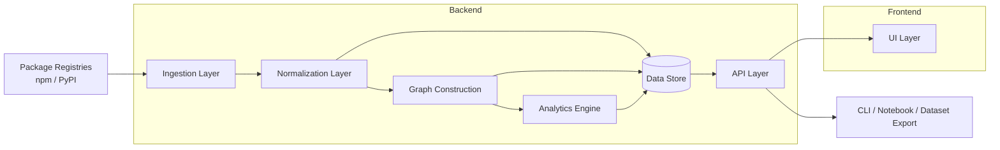
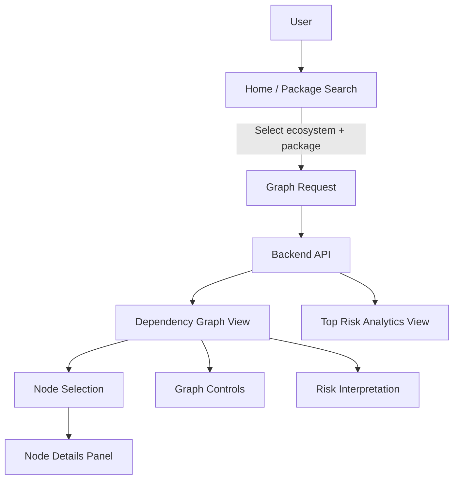
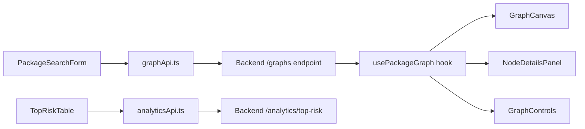
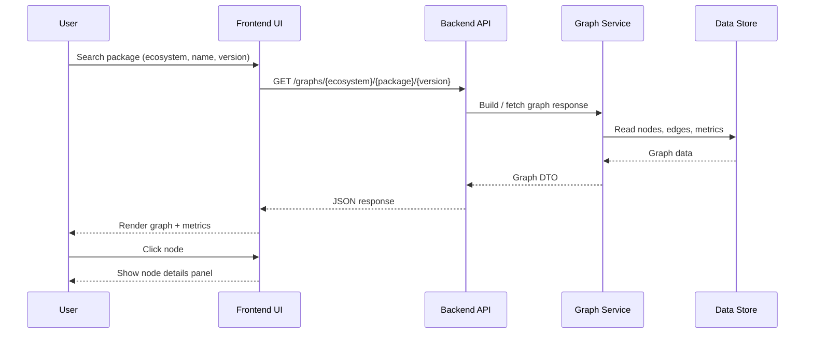

# OSCAR – UI & Visualization Plan
## Dependency Graph Observatory (MVP)

---

## 🎯 Purpose

This document defines the UI and visualization strategy for the **Dependency Graph Observatory** module within the OSCAR project.

The goal of this UI is not to build a full product interface, but to provide a **lightweight, modular, research-oriented visualization layer** that enables:

- Exploration of dependency graphs
- Visual validation of structural patterns
- Interpretation of graph-based risk metrics
- Effective communication of results in research discussions

---

## 🧠 Design Principles

The UI is designed following these core principles:

### 1. API-Driven
- The frontend consumes only backend APIs
- No direct dependency on storage or internal logic

### 2. Read-Only (MVP)
- No editing or mutation of data
- Focus on visualization and analysis

### 3. Modular
- UI is a separate layer from ingestion and analytics
- Can be replaced without impacting backend

### 4. Minimal but Insightful
- Prioritize clarity and interpretability over features
- Avoid unnecessary complexity

---

## 🏗️ Architecture Overview

The system is divided into three layers:

### Core Layer (Backend)
- Ingestion
- Graph construction
- Analytics

### API Layer
- Exposes graph and metrics

### UI Layer (Frontend)
- Visualization
- Interaction
- Exploration

---

## 🧰 Recommended Tech Stack

- React
- TypeScript
- Vite
- Cytoscape.js
- React Query
- Tailwind CSS (optional)

---

## 📐 Architecture Diagrams

### 1. System Architecture

### 2. UI Flow

### 3. Component Interaction

### 4. Request / Response Sequence

---

## 📄 MVP Pages

### 1. Home / Package Search
- Select ecosystem (npm, PyPI)
- Enter package name
- Optional version input

---

### 2. Dependency Graph View
Main visualization page.

Features:
- Graph rendering
- Node selection
- Zoom / pan
- Layout switching
- Node metrics display

---

### 3. Analytics / Top Risk
Displays:
- High-risk packages
- Key metrics (fan-in, fan-out, score)

---

## 🧩 Core Components

### GraphCanvas
- Renders graph using Cytoscape
- Handles interactions

### GraphControls
- Layout selection
- Reset view
- Toggle options

### NodeDetailsPanel
- Displays selected node information
- Metrics and metadata

### PackageSearchForm
- Input for loading graphs

### TopRiskTable
- Displays top-risk packages

---

## 🔌 API Contracts

### Get Graph
GET /graphs/{ecosystem}/{package}/{version}

### Get Package Details
GET /packages/{ecosystem}/{package}/{version}

### Get Top Risk
GET /analytics/top-risk

---

## 🎨 Visualization Strategy

### Node Size
- Based on bottleneck score or fan-in

### Node Types
- Root
- Direct dependency
- Transitive dependency
- High-risk node

### Edge Type
- depends_on

---

## 📅 UI Development Plan

### Week 1
- Setup frontend project
- Routing and layout
- API client

### Week 2
- Graph visualization
- Node interaction
- Search form

### Week 3
- Analytics view
- Filtering
- UI polish

---

## ⚠️ Scope Control

Avoid:
- Complex dashboards
- Real-time features
- Editing capabilities
- Over-engineering UI logic

---

## 🔮 Future Extensions

- Code-level visualization
- SBOM overlays
- Time-based graph evolution
- Advanced filtering and clustering

---

## 🤝 Collaboration Notes

This UI is a **supporting research tool**, not the core system.

> ⚠️ The design and implementation are expected to evolve based on feedback and research needs.

---

## 🎯 Outcome

A simple but powerful interface that allows researchers and collaborators to:

- Understand dependency structures
- Identify systemic risk patterns
- Validate analytical models visually
